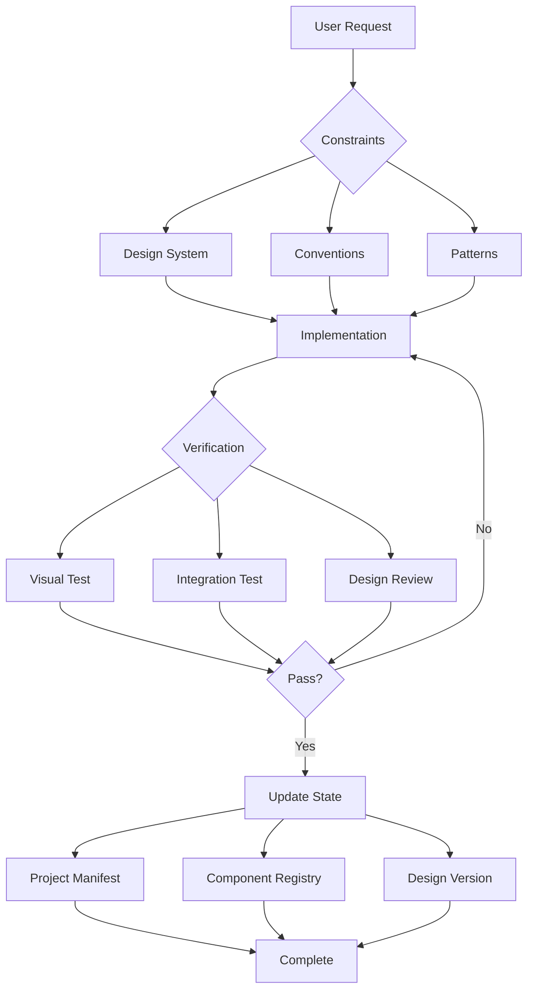

# Web App Builder Patterns: Quick Reference

## What Each System Does Best

### v0 (Vercel)
**Superpower:** Project coherence through CodeProject architecture

**Key Patterns:**
- **Persistent State:** Maintains full project context throughout conversation
- **Anti-Over-Engineering:** "Choose simplest, most conventional solution"
- **Progressive Disclosure:** Hidden implementation details loaded on demand
- **Convention Over Configuration:** Strict shadcn/ui patterns

**Steal This:**
```yaml
# CodeProject-like state management
project_state:
  files: {full_content_always}  # Never summaries
  modifications: {tracked_history}
  design_version: {locked_reference}
```

### Bolt
**Superpower:** Zero-drift through artifact persistence

**Key Patterns:**
- **Immutable Artifacts:** Complete project snapshot per change
- **WebContainer Execution:** Real runtime verification
- **Explicit Edit Protocol:** bolt_file_edits with FULL content
- **Immediate Preview:** See changes in real-time

**Steal This:**
```yaml
# Artifact-based verification
change_protocol:
  show: FULL file content (no patches)
  verify: Preview before claiming done
  track: Every modification in artifacts
```

### Loveable
**Superpower:** Design system enforcement that makes ugly impossible

**Key Patterns:**
- **Design System First:** ALL styles in design system, zero exceptions
- **Semantic Tokens Only:** No text-white, bg-black ever
- **Tool Preference:** search-replace > write (precision)
- **Debug First:** Check console before modifying code

**Steal This:**
```yaml
# Design enforcement
forbidden:
  - inline styles
  - color literals
  - arbitrary spacing
required:
  - semantic tokens (--primary, --surface)
  - design system variants
  - mathematical grid (4px)
```

### Manus
**Superpower:** Comprehensive tool ecosystem with clear boundaries

**Key Patterns:**
- **Tool Specialization:** Each tool has ONE clear purpose
- **Progressive Capability:** Tools revealed based on need
- **Explicit Boundaries:** Clear "can do" vs "cannot do"

**Steal This:**
```yaml
# Tool clarity
each_tool:
  single_purpose: true
  clear_boundaries: true
  examples_included: true
```

---

## Universal Patterns Across All Systems

### 1. State Management Is Everything
```
v0: CodeProject tracks all files
Bolt: Artifacts maintain history
Loveable: Context tracking prevents re-reads
→ Your System: Need persistent project state
```

### 2. Constraints Create Quality
```
v0: Convention-based (shadcn/ui only)
Loveable: Design system enforced
Bolt: Full content required
→ Your System: Reduce degrees of freedom
```

### 3. Verification Before Completion
```
v0: Checks if feature exists first
Loveable: Debugs before modifying
Bolt: Preview before done
→ Your System: Multi-step verification required
```

### 4. Progressive Complexity
```
v0: "Avoid over-engineering"
Loveable: "Don't do too much"
Anthropic: "Start simple"
→ Your System: Complexity gates needed
```

### 5. Tool Optimization Matters
```
Loveable: search-replace preferred
v0: Structured code blocks
Bolt: Explicit edit tags
→ Your System: Precise operations over broad ones
```

---

## Mapping to Your Design-OCD Requirements

### Your Requirement → Implementation Pattern

**"Pixel-perfect layouts"**
→ Loveable's semantic token enforcement
→ Mathematical grid system (4px)
→ No arbitrary values allowed

**"Evidence-based verification"**
→ Bolt's preview system
→ Screenshot before/after
→ Visual regression testing

**"Zero tolerance for inconsistencies"**
→ v0's convention enforcement
→ Design system as law
→ Automated design review

**"Mathematical spacing"**
→ Constrained value sets [4, 8, 16, 24, 32]
→ Calculated relationships
→ Grid overlay verification

---

## The Magic Formula

**Reliability = Constraints + Verification + State Management**



---

## Quick Implementation Checklist

### Week 1: Foundation
- [ ] Implement project state manager (like v0's CodeProject)
- [ ] Enforce design-dna.json in all UI agents
- [ ] Add screenshot verification to frontend-engineer
- [ ] Block inline styles at tool level

### Week 2: Constraints
- [ ] Define allowed spacing values [4, 8, 16, 24, 32]
- [ ] Implement semantic token enforcement
- [ ] Add design-review as mandatory gate
- [ ] Create component registry

### Week 3: Verification
- [ ] Add visual regression testing
- [ ] Implement preview before completion
- [ ] Create design compliance scorer
- [ ] Add responsive breakpoint checker

### Week 4: Optimization
- [ ] Switch to search-replace operations
- [ ] Implement progressive disclosure
- [ ] Add complexity gates
- [ ] Create feedback loops

---

## Remember

**The goal isn't better prompts - it's better architecture.**

These systems succeed not because they ask for "beautiful UI" but because they make ugly UI structurally impossible.